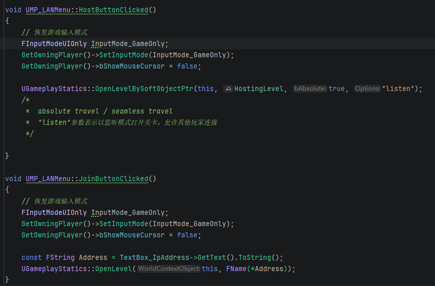
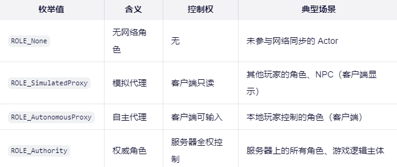
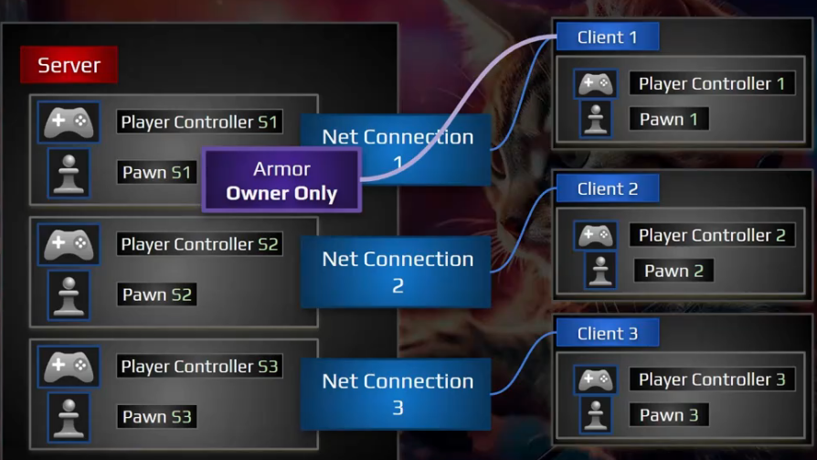

# UE5 多人游戏基础

## 一、LAN局域网联机


主机通过以listen监听模式打开关卡，客户端通过主机IP地址连接主机。

## 二、Online Subsystem子系统
**基本结构和用途**
基本模块 OnlineSubsystem 定义服务指定的模块，并在引擎中进行注册。在初始化期间，在线子系统将尝试加载"Engine.ini"文件中指定的默认在线服务模块。对在线服务的所有访问都将通过此模块。

### 1. Steam Online Subsystem
我们可以通过Steam在线子系统托管游戏会话，主机在Steam上通过游戏会话开启监听服务器，其他玩家也能加入这个会话。
UE内置了支持多个平台的在线子系统，这些子系统能让我们针对不同平台配置项目，无需编写平台专属代码，无需直接对接平台API，只需配置项目启用对应平台的在线子系统即可。

具体步骤：
1. 添加Steam插件：
    - Online Subsystem Steam
    - Steam Socket（UE5.6+）
2. 在项目配置文件DefaultEngine.ini中添加网络驱动（NetDriver）和一些参数配置让项目适配Steam：
```ini
[/Script/Engine.GameEngine]
+NetDriverDefinitions=(DefName="GameNetDriver",DriverClassName="OnlineSubsystemSteam.SteamNetDriver",DriverClassNameFallback="OnlineSubsystemUtils.IpNetDriver")

[OnlineSubsystem]
DefaultPlatformService=Steam

[OnlineSubsystemSteam]
bEnabled=true
SteamDevAppId=480
bInitServerOnClient=true

[/Script/OnlineSubsystemSteam.SteamNetDriver]
NetConnectionClassName="OnlineSubsystemSteam.SteamNetConnection"
```
> 可以在配置文件DefaultGame.ini中添加一些游戏会话参数配置，例如游戏最多联机人数等

3. 添加Mutiiplayer Sessions插件
4. 确保Steam客户端在后台运行：
    - 确保所有玩家Steam设置中的下载区域相同

## 三、Replication（复制）
复制是从服务器向客户端同步Actor状态的过程。通过复制，服务器可以将游戏世界中的Actor及其属性、组件等信息发送给所有连接的客户端，确保每个玩家看到的游戏状态是一致的。

- Actor复制的相关属性：
    - **NetLoadOnClient（客户端网络加载）**：地图加载时是否在客户端加载，false则只在服务器存在
    - **Replication（复制）**：
        - 将Actor设为可复制对象，只要变量被标记为可复制，该变量数据就会在服务器和客户端之间同步。
        - 会强制启用客户端网络加载
    - **Replication Movement**：Actor启用复制并不会自动同步移动，需要单独启用移动复制

### 1. 权限 与 NetRole（网络角色）
- LocalRole（ENetRole）：表示当前机器上该 Actor 的角色。
- RemoteRole（ENetRole）：表示其他机器上该 Actor 的对应副本的角色。


1. 服务器上的玩家角色（权威角色）
LocalRole = ROLE_Authority
RemoteRole = ROLE_AutonomousProxy（对拥有该角色的客户端）或 ROLE_SimulatedProxy（对其他客户端）
✅ 服务器拥有最终决策权，负责同步状态给所有客户端。

2. 客户端上的本地玩家角色（自主代理）
LocalRole = ROLE_AutonomousProxy
RemoteRole = ROLE_Authority
✅ 客户端可以处理输入（如移动、开火），但关键操作需提交服务器验证。

3. 客户端上的其他玩家角色（模拟代理）
LocalRole = ROLE_SimulatedProxy
RemoteRole = ROLE_Authority
✅ 仅从服务器接收位置、动画等状态，进行插值平滑显示，不能控制。

4. 专用服务器上的非玩家 Actor（如掉落物）
LocalRole = ROLE_Authority
RemoteRole = ROLE_SimulatedProxy
✅ 服务器控制物理状态，客户端只做视觉模拟。

HasAuthority()函数用于检查当前Actor是否具有权限角色。

### 2. Attachment（附加）
- Actor Attachment：Actor附加也能被复制，但需要Actor本身是可复制的，附加才能复制
    AttachToActor函数
- Component Attachment：组件需要启用复制
    AttachToComponent函数

### 3. 变量复制

**第1步：重写 GetLifetimeReplicatedProps**
```cpp
virtual void GetLifetimeReplicatedProps(TArray<FLifetimeProperty>& OutLifetimeProps) const override;
```
✅ 作用：
这是 UE 网络复制系统的“注册入口”。引擎在 Actor 初始化时会调用此函数，收集所有需要复制的属性列表。

🔍 原理：
每个 AActor 子类都可以通过重写此函数，告诉引擎：“我有哪些变量需要同步”。
引擎内部会缓存这个列表，在后续网络更新时只同步这些变量。
如果不重写此函数，即使变量标记为 Replicated，也不会被同步

📌 关键点：
必须调用 Super::GetLifetimeReplicatedProps(...)，以继承父类的复制属性（如 ACharacter 的位置、旋转等）。
此函数只在 服务器权威（Authority） 下生效。

**第2步：声明变量并标记 UPROPERTY(Replicated)**

**第3步：在 .cpp 中调用 DOREPLIFETIME 宏**
```cpp
// 在 .cpp 文件中（通常在 GetLifetimeReplicatedProps 实现内）
void AMutiplayer_CppCharacter::GetLifetimeReplicatedProps(TArray<FLifetimeProperty>& OutLifetimeProps) const
{
    Super::GetLifetimeReplicatedProps(OutLifetimeProps);
    
    DOREPLIFETIME(this, Armor); // ← 这就是第3步
}
```
✅ 作用：
正式将 Armor 注册到网络复制系统中，使其成为“受管复制属性”

🔍 原理：
DOREPLIFETIME(Class, Property) 是一个宏，展开后会向 OutLifetimeProps 数组添加一条 FLifetimeProperty 记录。
引擎根据此记录监听 Armor 的值变化，当服务器上 Armor 改变时，自动打包新值发送给客户端，客户端收到后自动赋值（无需手动处理）

📌 关键细节：
必须写在 GetLifetimeReplicatedProps 函数体内
类名必须与当前类一致，可以使用this
此宏只处理简单类型（如 float, int32, bool, FVector 等）。复杂对象（如 UObject*）需用 DOREPLIFETIME_CONDITION 等高级宏。

### 4. RepNotify（复制通知）
- 复制变量指定RepNotify
    - 定义复制变量时，通过UPROPERTY宏的ReplicatedUsing参数指定RepNotify函数
    - 声明回调函数（通常为 private）
```cpp
//////in .h//////////
	UPROPERTY(ReplicatedUsing = OnRep_PickupCount)
	int32 PickupCount;

private:
    UFUNCTION()
    void OnRep_PickupCount(); // 注意：无参数，返回 void
```

- 复制变量发生变化时触发RepNotify函数
    - 不会在服务器上触发（除非在蓝图中）
    
- RepNotify能接收变量类型参数————能得到该变量的前值
```cpp
/////////in .h//////////
	UFUNCTION()
	void OnRep_PickupCount(int32 PreviousCount);    // 注意：参数为变量类型，得到的是前值

////////in .cpp//////////
void AMutiplayer_CppCharacter::OnRep_PickupCount(int32 PreviousCount)
{
	GEngine->AddOnScreenDebugMessage(
	-1, 
	5.f, 
	FColor::Red, 
	FString::Printf(TEXT("[Debug] PickupCount RepNotify Triggered. PreviousCount is: %d, Current Count: %d"), PreviousCount, PickupCount)
	);
	
}
```

### 5. ReplicationCondition（复制条件）
在UE5的多人联机开发中，复制条件（Replication Condition） 是控制 “何时、对谁、以何种频率” 同步变量或 Actor 的关键机制。它让你能精细地优化网络带宽、提升性能，并实现复杂的同步逻辑（如仅对拥有者同步、仅在变化时同步等）。

默认情况下，所有标记为 Replicated 的变量都会：
从服务器 → 所有相关客户端 同步（只要值改变就立即同步），但这在实际项目中往往浪费带宽或暴露信息
例如：
| 问题场景 | 解决方案 |
| :--- | :--- |
| 玩家背包物品只应自己看到 | 仅对拥有者（Owner）同步 |
| 敌人血量不应被透视看到 | 仅对队友同步，不对敌人同步 |
| 角色位置每帧都变，但小变动无需同步 | 仅当变化超过阈值时同步 |
| 某些状态只在游戏开始时同步一次 | 仅初始化时同步 |

✅ 复制条件就是解决这些问题的“过滤器”

UE5 支持两种粒度的复制控制：

#### （1）变量级复制条件（Property-Level）
控制单个变量的同步行为。

**1. 基本语法：DOREPLIFETIME_CONDITION**
```cpp
// 在 GetLifetimeReplicatedProps 中
DOREPLIFETIME_CONDITION(YourClass, YourVariable, COND_SimulatedOnly);
```
> ⚠️ **注意**：普通 `DOREPLIFETIME` 相当于 `COND_None`（即无特殊条件）。

**2. 内置复制条件枚举（ELifetimeCondition）**
以下是常用条件（完整列表见 `Engine/Source/Runtime/CoreUObject/Public/UObject/CoreNet.h`）：

| 条件 | 说明 | 典型用途 |
| :--- | :--- | :--- |
| COND_None | 默认：对所有相关客户端同步 | 普通状态（如角色模型） |
| COND_OwnerOnly | 仅对拥有者（Owner）同步 | 背包物品、私有状态 |
| COND_SkipOwner | 对除拥有者外的所有人同步 | 队友可见的标记（如“正在治疗”） |
| COND_SimulatedOnly | 仅对 SimulatedProxy 同步（其他玩家） | NPC 动画参数 |
| COND_AutonomousOnly | 仅对 AutonomousProxy 同步（本地玩家） | 客户端预测相关数据 |
| COND_ReplayOrOwner | 回放或拥有者 | 录像系统 |
| COND_Custom | 自定义条件（需重写 IsNetRelevantFor 等） | 复杂逻辑（如视野内才同步） |
| COND_InitialOnly | 仅在 Actor 初始化时同步一次 | 初始装备、角色名 |
| COND_Never | 永不同步（即使标记 Replicated） | 调试用 |

**3. 使用示例**

**示例1：仅对自己同步背包**
```cpp
// PlayerCharacter.h
UPROPERTY(Replicated)
FInventory Inventory;

// PlayerCharacter.cpp
void APlayerCharacter::GetLifetimeReplicatedProps(TArray<FLifetimeProperty>& OutLifetimeProps) const
{
    Super::GetLifetimeReplicatedProps(OutLifetimeProps);
    DOREPLIFETIME_CONDITION(APlayerCharacter, Inventory, COND_OwnerOnly);
}
```
✅ 只有该玩家自己的客户端会收到 Inventory 更新，其他玩家看不到。

**示例2：仅初始化时同步角色名**
```cpp
DOREPLIFETIME_CONDITION(APlayerCharacter, PlayerName, COND_InitialOnly);
```
✅ 进入游戏时同步一次，之后不再发送。

#### *\*自定义复制条件（Custom Conditions）*
UE 的复制系统在准备发送数据包前，会为每个连接（Connection）调用你的自定义函数，询问：“这个变量要不要发给这个客户端？”

关键机制：
1. 在 DOREPLIFETIME_CONDITION 中指定 COND_Custom
--
2. 重写 PreReplication()，定义bool变量控制复制，在 PreReplication 中调用 DOREPLIFETIME_ACTIVE_OVERRIDE 宏来关联该bool变量与目标复制变量
--
3. 当bReplicatePickupCount为true时，PickupCount变量会被复制给所有相关客户端；为false时则不会复制。在关闭期间复制变量发生了变化，在下一次开启时会立即同步最新值。
示例：
```cpp
// 在.h 文件中
public:
    virtual void PreReplication( IRepChangedPropertyTracker& ChangedPropertyMap ) override;

private:
	// 自定义复制条件 - 控制是否复制PickupCount变量
	bool bReplicatePickupCount = false;

// 在.cpp 文件中
void AMutiplayer_CppCharacter::PreReplication(IRepChangedPropertyTracker& ChangedPropertyMap)
{
	Super::PreReplication(ChangedPropertyMap);
	
	// 将bReplicatePickupCount 与 PickupCount（被控制的复制变量） 关联（bReplicatePickupCount 为 true 则开始复制）
	// 【注意】：bReplicatePickupCount 的值只在服务器上起作用
	// 【注意】：使用 DOREPLIFETIME_ACTIVE_OVERRIDE 必须将 NetCore 加入Build.cs，否则会导致链接错误
	DOREPLIFETIME_ACTIVE_OVERRIDE(ThisClass, PickupCount, bReplicatePickupCount);
}
// 在某个时机点设置 bReplicatePickupCount 的值来控制PickupCount的复制
```


> ⚠️ **注意**：**布尔值的判断只在服务器端生效，必须在服务器端修改该bool变量值才能影响变量的复制状态**。
此机制仅适用于变量级复制，不适用于 Actor 级可见性（后者用 IsNetRelevantFor）。


---
**PreReplication 和 GetCustomLifetimeReplicationCondition 的区别与联系**
在 UE5 的多人联机开发中，PreReplication 和 GetCustomLifetimeReplicationCondition 是两个底层但极其强大的网络同步控制函数。它们共同构成了 “动态、精细、高效” 的自定义复制系统，适用于内置复制条件枚举无法满足的复杂场景。

两种方式核心定位对比：
|特性	|PreReplication	|GetCustomLifetimeReplicationCondition
|-|------|-|
|作用层级	|Actor 级（每帧处理整个 Actor 的所有变量）	|变量级 + 连接级（每变量 × 每客户端连接）
|调用频率	|每 Actor 每帧 1 次（在服务器上）	|每标记为 COND_Custom 的变量 × 每相关客户端连接 × 每帧
|主要目的	|动态启用/禁用变量复制、预计算通用状态	|基于连接身份精细过滤（如仅对队友同步）
|性能开销	|低（集中处理）	|高（分散多次调用）
|典型用途	|根据角色状态开关同步（如仅移动时同步）	|基于队伍、权限、距离的 per-client 判断

✅ 一句话总结：
PreReplication = “今天哪些变量值得寄？”（全局决策）
GetCustomLifetimeReplicationCondition = “这个包裹该寄给谁？”（个体决策）

#### （2）Actor 级复制条件（Actor-Level）
控制整个 Actor 是否被复制，以及对哪些连接（Connections）可见。


### 6. Ownership（所有权）
#### （1）Owner（拥有者）
- Actor所有权基础API：
    - virtual void SetOwner(AActor* NewOwner);
    - AActor* GetOwner() const;
        - 若不指定其拥有者，则可能为空

- Pawn
    - 当我们操作一个角色时，该角色的拥有者会自动设置为控制该角色的 PlayerController。

✅ 组件（Component）的所有权
UActorComponent 通过 GetOwner() 返回其所属的 AActor
注意：组件不能直接设置 Owner，它继承自其 Actor

#### （2）Owning Connection（所属连接）
在UE的C-S模式的多人游戏中，客户端连接服务器即可开始游戏，客户端连接服务器后，服务器会为该客户端创建一个PlayerController，并对应该客户端为其创建一个专属的**UNetConnection**对象，该连接对象代表了客户端与服务器之间的网络连接。

所以 Actor（Pawn）的 Owning Connection 都指向该Actor（Pawn）所属的PlayerController连接的 UNetConnection 对象。
可以沿拥有关系层级向上追溯逐级检查拥有者，直到找到 PlayerController 为止，就能定位到对应的 Owning Connection。



> 在**监听服务器**模式下，服务器端的 PlayerController **没有 Owning Connection**，因为服务器不需要通过网络连接与自己通信。

#### （3）NetRelevancy（网络相关性）
网络相关性决定 “Actor 是否应被复制到某个客户端”。它与所有权紧密关联。

核心属性：
|属性	|说明	|默认值
|-|------|-|
|bOnlyRelevantToOwner	|仅对 Owning Client 复制	|false
|bAlwaysRelevant	|对所有相关客户端复制（忽略距离）	|false
|bNetUseOwnerRelevancy	|使用拥有者的相关性规则	|false
|NetDormancy	|休眠策略（进一步优化）	|DORM_Awake

### 7. ActorComponents 复制
组件需要启用复制，且组件所属的 Actor 也必须是可复制的，组件才能被复制。

组件复制可以由组件所有者或组件自身发起复制（两种方式都可以）：
- 在 Component 的构造函数中设置
- 在 Actor 的构造函数中设置
```cpp
// 在 Component 构造函数中启用组件复制
SetIsReplicatedByDefault(true);
------------------------------------
// 在 Actor 构造函数中启用组件复制
MyComponent->SetIsReplicated(true);
```


## 四、Remote Procedure Call（RPC-远程过程调用）
RPC（Remote Procedure Call）是UE5中实现网络通信的核心机制之一。它允许你在本地机器上调用一个函数，但让该函数在另一台机器（服务器或客户端）上执行。

### 1. RPC 的三种类型
UE5 提供了三种类型的 RPC，通过 `UFUNCTION` 宏中的关键字指定：

| 类型 | 关键字 | 调用方 | 执行方 | 典型用途 |
| :--- | :--- | :--- | :--- | :--- |
| **Server RPC** | `Server` | 客户端 | 服务器 | 客户端请求服务器执行操作（如：开火、拾取物品、请求移动） |
| **Client RPC** | `Client` | 服务器 | 特定客户端 | 服务器通知特定客户端发生某事（如：更新UI、播放只有该玩家听到的声音） |
| **Multicast RPC** | `NetMulticast` | 服务器 | 所有客户端 + 服务器 | 广播事件（如：爆炸特效、全局音效、死亡动画） |

> **注意**：
> - 如果服务器调用 Server RPC，它会直接在服务器上执行（就像普通函数）。
> - 如果客户端调用 Client RPC，它会直接在客户端上执行。
> - Multicast RPC 通常由服务器调用。如果客户端调用 Multicast RPC，它只会在本地执行，不会广播。

### 2. 使用要求与所有权
RPC 的执行严重依赖于 **Actor 的所有权（Ownership）**。

1.  **Actor 必须是 Replicated 的**
2.  **Server RPC**：
    - 必须由 **拥有该 Actor 的客户端** 调用
    - 如果一个客户端尝试在它不拥有的 Actor 上调用 Server RPC，调用会被丢弃
    - 常见场景：PlayerController 拥有 Pawn，所以 Pawn 可以调用 Server RPC
3.  **Client RPC**：
    - 只能发送给 **拥有该 Actor 的客户端**
    - 如果 Actor 没有拥有者（如场景中的普通物体），Client RPC 不会发送给任何人
4.  **Multicast RPC**：
    - 不受所有权限制，发送给所有相关客户端

### 3. 可靠性（Reliability）
在声明 RPC 时，必须指定它是 **Reliable（可靠）** 还是 **Unreliable（不可靠）**。

- **Reliable**：
    - 保证到达，且保证顺序。
    - 适用于关键游戏逻辑（如：开火、购买物品、生成物体）。
    - **注意**：过多的 Reliable RPC 会阻塞网络队列，导致延迟。
- **Unreliable**：
    - 不保证到达，也不保证顺序。可能会丢包。
    - 适用于频繁更新且丢失一两次无所谓的视觉效果（如：粒子特效、临时声音、高频位置修正）。

### 4. 实现步骤

#### （1）头文件声明 (.h)
使用 `UFUNCTION` 宏，并指定类型和可靠性。

```cpp
// Server RPC：客户端请求开火
UFUNCTION(Server, Reliable, WithValidation)
void Server_Fire();

// Client RPC：通知客户端更新弹药UI
UFUNCTION(Client, Reliable)
void Client_UpdateAmmo(int32 NewAmmo);

// Multicast RPC：广播开火特效
UFUNCTION(NetMulticast, Unreliable)
void Multicast_FireEffect();
```

#### （2）源文件实现 (.cpp)
不需要直接实现声明的函数名，而是实现 `函数名_Implementation`。
如果使用了 `WithValidation`，还需要实现 `函数名_Validate`。

```cpp
// 1. Server RPC 实现
void AMyCharacter::Server_Fire_Implementation()
{
    // 在服务器上执行的逻辑
    // 比如：扣除弹药、生成子弹 Actor
    if (Ammo > 0)
    {
        Ammo--;
        MulticastFireEffect(); // 服务器调用广播，让所有人看到特效
    }
}

// Server RPC 验证（可选，但推荐用于防作弊）
bool AMyCharacter::ServerFire_Validate()
{
    // 返回 true 表示允许执行，返回 false 表示非法调用（可能会踢出玩家）
    return Ammo >= 0; 
}

// 2. Client RPC 实现
void AMyCharacter::ClientUpdateAmmo_Implementation(int32 NewAmmo)
{
    // 只在拥有该角色的客户端执行
    if (APlayerController* PC = Cast<APlayerController>(GetController()))
    {
        if (AMyHUD* HUD = Cast<AMyHUD>(PC->GetHUD()))
        {
            HUD->UpdateAmmoDisplay(NewAmmo);
        }
    }
}

// 3. Multicast RPC 实现
void AMyCharacter::MulticastFireEffect_Implementation()
{
    // 在服务器和所有客户端上执行
    // 播放粒子特效、声音等
    UGameplayStatics::SpawnEmitterAtLocation(GetWorld(), FireEffect, GetActorLocation());
}
```

### 5. WithValidation（验证）
`WithValidation` 关键字用于 Server RPC，增加一层安全检查。
- **目的**：防止作弊或非法数据。
- **工作方式**：在执行 `_Implementation` 之前，先执行 `_Validate`。
- **返回值**：
    - `true`：验证通过，继续执行 `_Implementation`。
    - `false`：验证失败，**服务器会断开与该客户端的连接**（认为其在作弊或发生严重错误）。

> 从 UE5 开始，`WithValidation` 对 Server RPC 不再是强制的，但为了安全起见，建议对涉及关键玩法的 Server RPC 加上验证。

---

**RPC 流程图：**
1. **客户端调用** `ServerFire()`。
2. **引擎拦截**，检查是否是 Server RPC。
3. **打包数据**，通过网络发送给服务器。
4. **服务器接收**，调用 `ServerFire_Validate()`。
5. 如果验证通过，**服务器执行** `ServerFire_Implementation()`。
6. 在 `ServerFire_Implementation` 中，服务器可能会修改变量（通过 Replication 同步回客户端）或调用 `MulticastFireEffect()`。

---

**RPC 与 Replicated Variables 的对比：**
|特性 | RPC | Replicated Variable |
| --- | --- | --- |
| 用途 | 事件驱动（触发动作） | 状态同步（保持一致）|
| 方向 | 单向（C→S 或 S→C） | 服务器 → 客户端|
| 频率 | 按需调用 | 自动（值改变时）|
| 可靠性 | 可选 Reliable/Unreliable | 总是 Reliable|
| 典型场景 | 开火、聊天、技能释放 | 生命值、位置、装备|

✅ 黄金法则：
状态用 Replication（如 Health, Position）
事件用 RPC（如 Fire, Explode, ChatMessage）