# 网络同步技术

网络同步核心目标：达到体验的一致性

游戏程序分层结构：
1. **输入模块**
2. **核心逻辑模块** —> Gameplay
3. **输出控制模块**
4. **输出模块**
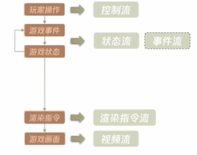

## 主流同步模型
### 帧同步-同步控制流

#### 1. 基本原理
客户端核心逻辑模块相同，输入相同，输出相同

#### 2. 模块结构
玩家输入直接发送至服务器，服务器处理后返回frame给所有玩家
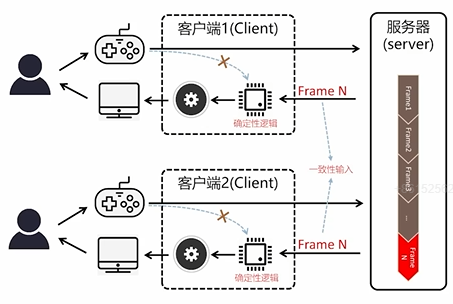

#### 3. 输入一致性
    每一个客户端的**自然时间**无法做到绝对一致，最好的办法是让核心逻辑模块中所有涉及到时间的计算都使用**逻辑时间**（逻辑时间可以通过帧号计算得到）
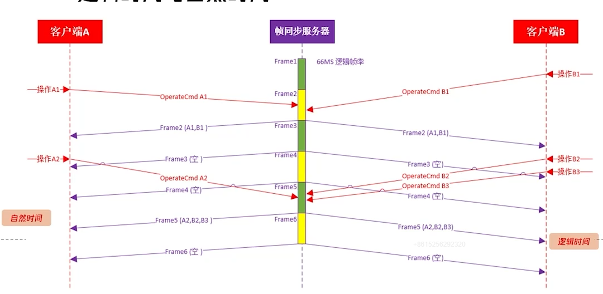

#### 4. 逻辑的确定性
- 浮点数，降低精度（old）
- 定点数
> 参考学习《腾讯游戏开发精粹》

- 相关开源工具：
    - **Fate**：物理引擎及数学库（Rust版本开源），主要提供了一个决定性的基于位置动力学物理引擎，附带提供了一个定点数学库、一套**通用的帧同步通信框架**
    - **LogTrack**：一致性诊断工具（C#/C++版本）用来对比两个客户端之间逻辑流程一致性的日志工具（通过自动化工具为GamePlay所有函数都插入日志输出）

总结：
1. 逻辑状态的确定性：使用整数或定点数来表达状态
2. 逻辑过程的确定性：
    - 仅使用基于整数和定点数，并且算法一致的功能库：基于定点数的玩法框架、行为树、蓝图、物理引擎等
    - 表现与逻辑分离：**表现层不可修改逻辑层，逻辑乘不可依赖表现层**（表示涉及渲染，渲染会使用到系统的浮点数，会带来不确定性）
    - 注意：逻辑层没有主角概念（每个客户端的主角是不一样的），谨慎使用多线程
    
#### 5. 优化
- **断线重连恢复**
    - 短单局：直接快速**追帧**（服务器将所有帧发送给客户端）
    - 长单局：服务器有太多帧不适合直接追帧
        1. 结合状态同步：先将整个核心逻辑模块直接恢复到最近的状态
        2. 再从该状态追帧
        > 完全状态同步：内存快照技术
        参考实现：[SGMemory](https://github.com/slicol/SGMemory)

- **安全与反作弊**
    - 安全：如帧同步一般需要链接到单独的帧同步服务器，需要有它自己的协议加密和认证
        - 协议加密：DES、AES、TEA/XTEA/XXTEA 等加密算法，
        - 自有认证：帧同步独立的权限认证
        - 包防篡改：奇偶校验
        - 安全数据类型：SDT
    - 反作弊：在帧同步模型中因为服务器无法进行仲裁（游戏逻辑在客户端），所以一般采用校验的方式
        - 实时校验：对战斗中的异常情况进行数值校验、战斗中实时逻辑校验等
        - 结算校验：对单局结果进行数值校验，如有异常进行逻辑校验
        - 用户画像：识别作弊
        > 服务器端无法判定到底是谁作弊，对两人以上的多人游戏可以通过各个玩家数据互相对比揪出作弊者，而对双人对战游戏可以建立一个完全用于校验的校验服（外网运行多个版本的客户端时要运行多个版本的校验进程），一个校验进程可以跑多个校验线程

- **网络抖动**
    - 产生原因：服务器给客户端下发的帧序列一定是均匀的，但由于网络传输的不可控性，客户端收到的帧序列往往是不均匀的，从而导致游戏体验不佳
    - 通用解决方法：**JitterBuffer**（抖动缓冲区），通过延迟一定时间来平滑网络抖动带来的影响
        - 客户端维护一个缓冲区，存储收到的帧数据，延迟一定时间（缓冲区大小）来处理帧
        - 缺点：增加了延迟，损失了操作的实时性（延迟的大小取决于我们要缓存多少帧）
        > 可以通过结合**预表现**技术（相当复杂）来缓解延迟带来的影响，例如移动预表现。
        
#### 6. 实际案例：FSPLite
参考实现：[FSPLite](https://github.com/slicol/SGF)（一个轻量级的帧同步网络模块，内置在SGF项目中）
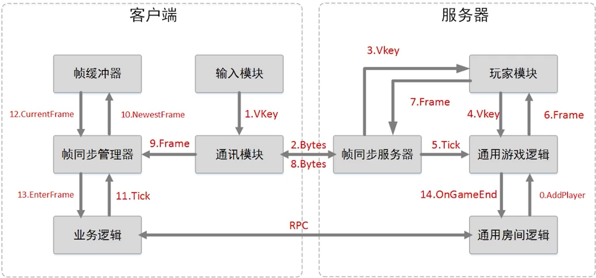    

**系统整体架构与数据流向**
1. 输入模块负责将玩家操作转化为虚拟按键（Vkey），并通过通信模块以二进制方式发送至服务器（与服务器建立稳定的底层连接）
2. 服务器端通过对应的具体玩家模块接收操作（一个玩家操作对应一个玩家模块），玩家模块将Vkey发送给帧同步的通用游戏逻辑进行处理，主要分为两个部分：1.驱动通用游戏逻辑状态变更（主要是游戏开始、游戏结束等）；2.记录操作。
3. 帧驱动机制由服务器统一推进，每帧结束时帧同步的通用游戏逻辑会将收集到的所有玩家模块的Vkey打包为一个Frame发送给所有的玩家模块，在通过可靠帧同步（RUDP）发送给客户端的通讯模块。
4. 客户端通过通信模块接收帧数据，经“帧同步管理器”进行一些必要的处理后（如加速追帧、缓存等），帧同步管理器先将Frame放进一个缓冲器，然后等在业务逻辑的驱动，当业务逻辑驱动帧管理器的时候，帧同步管理器就会从缓冲器里去除当前的一帧并输入给业务逻辑，最终驱动这个业务逻辑的运转。

**客户端（Client）基本流程**
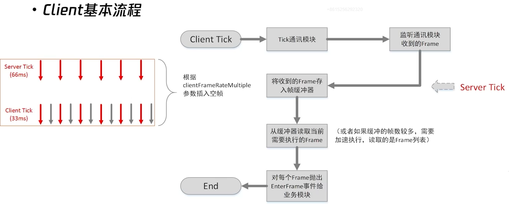
> 帧率比：服务器tick频率通常低于客户端tick（如1:2、1:3、1:4），旨在降低服务器负载和网络带宽消耗，提升并发能力让服务器能够同时处理更多的单局。

**服务器（Server）基本流程**
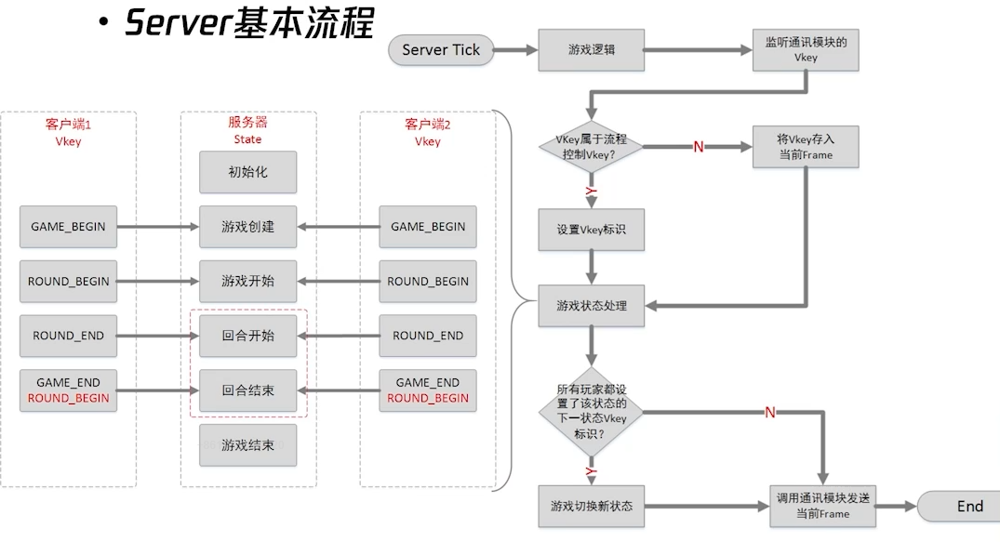
包含初始化、游戏创建、游戏开始、回合开始/结束（可循环）、游戏结束等固定状态；通过客户端发送特定操作（如game begin）触发状态机转换。

**单局状态与操作**
- 理想状态：所有状态都应该保存在客户端，包括单据状态
- 实际情况：为了断线重连、安全校验、数据分析等需求，将单局状态保存在服务器
- 大多数帧同步游戏的单局状态和操作都是相似的

**简易的贪吃蛇同步示例**
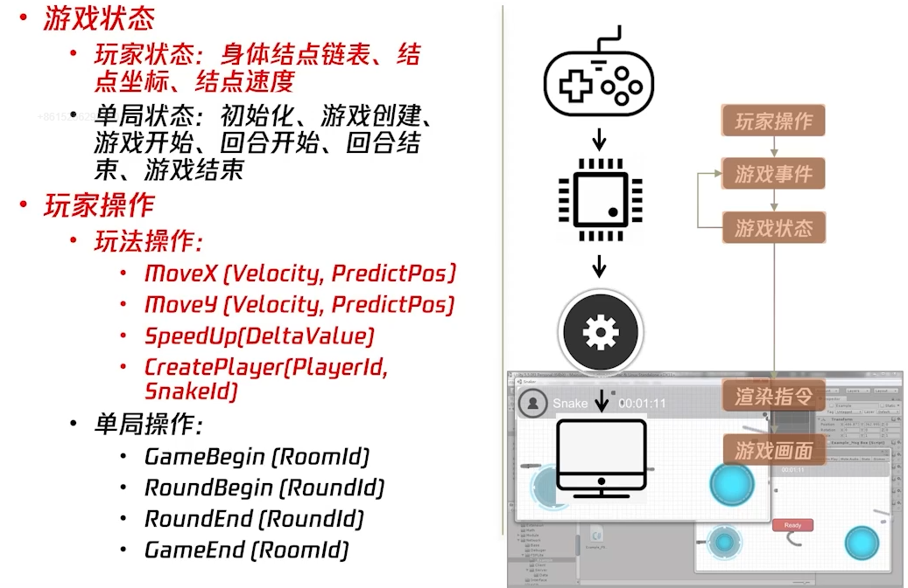

#### 7. 总结
- 优点：
    - 服务器逻辑简单，负载低；整体研发周期短
    - 表现一致性高；同步流量小，带宽成本低
    - 支持快速观战、录像、回放等功能（本质上其实就是最基本的追帧功能）；具有通用性
- 缺点：
    - 反外挂问题严峻（校验服）
    - 网络延迟的敏感度高；**不同步问题比较难定位和解决**（对帧同步来说它的状态和操作是环环相扣的，某一时刻状态发生错误则会引发连锁效应，当人眼发现错误的时候距离错误发生源头已经很远了），这时候就需要使用像LogTrack这种方式通过对所有函数都打日志来进行检测。
    - 单局规模受限（解决方案探索方向：分布式帧同步等）；技术门槛高

- 适用场景：
    - 单局规模适中
    - 不会中途加入角色
    - 实时性要求较高
    （例如：ACT、FTG、SPG、RTS、ARTS/MOBA）

### 状态同步-同步状态流/事件流

#### 1. 基本原理
S为游戏状态集合，S1和S2为分别为玩家关注的状态集合（通常玩家只会关注自己的集合和共同集合部分）
**核心要点**：状态同步就是对每个客户端所共同关注的状态进行同步

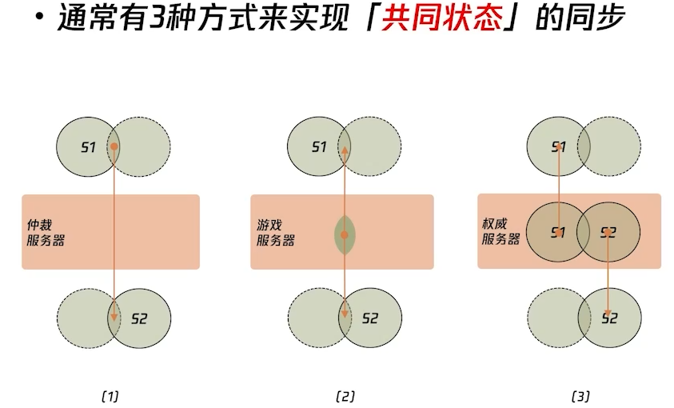
说明：
实际项目中，【1】和【2】通常会结合使用，【3】是极端特例。
在服务器中也不止会维护玩家的共同状态，也会维护玩家的一些非共同状态（如玩家姓名、资源数据等，保持玩家数据的持久性以及安全性等）

#### 2. 模块结构
1. 方式【1】和【2】
与具体玩法强相关
客户端运行游戏的主体逻辑，而服务端运行游戏的关键逻辑（仲裁逻辑）

2. 方式【3】
与玩法弱相关
客户端只运行游戏的一部分逻辑（模拟逻辑），而服务器运行游戏的绝大部分逻辑（权威逻辑）
权威服务器相对于方式【1】和【2】来说，可以更加准确，更加全面和安全。（例如FPS游戏）

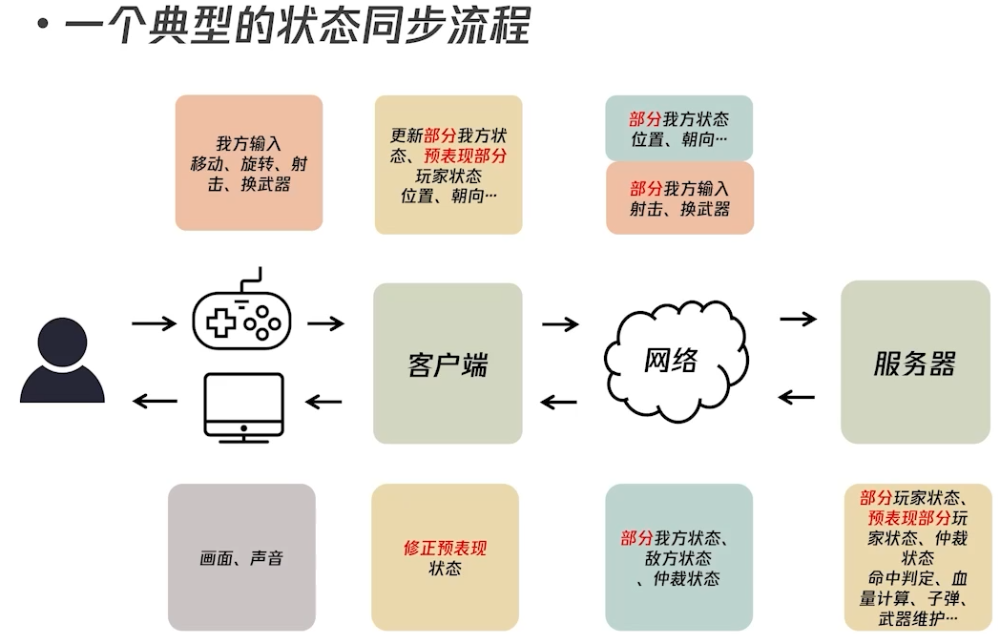

#### 3. 状态一致性
哪些状态需要同步？
- 根据是否影响核心博弈结果
    - 核心一致性：异步交互、单点仲裁、实时同步来保障一致性
    - 非核心一致性：多点仲裁、延迟同步来进行高性价比的处理

**冲突问题**：
- 事件冲突、状态冲突
- 解决方式：将事件的仲裁放到单点服务器上，对单点服务器来说无论两个玩家看起来怎么同时都是有先来后到的顺序

**仲裁问题**：
- 回溯判定：例如FPS游戏中，服务器的玩家状态（位置）有延迟，射击指令有延迟，服务器需要回溯射击发生当时的状态进行判断。回溯需要对时钟进行同步
- 时间同步：**NTP（Network Time Protocol）算法**（成熟方案）

#### 4. 优化
- **客户端插值**
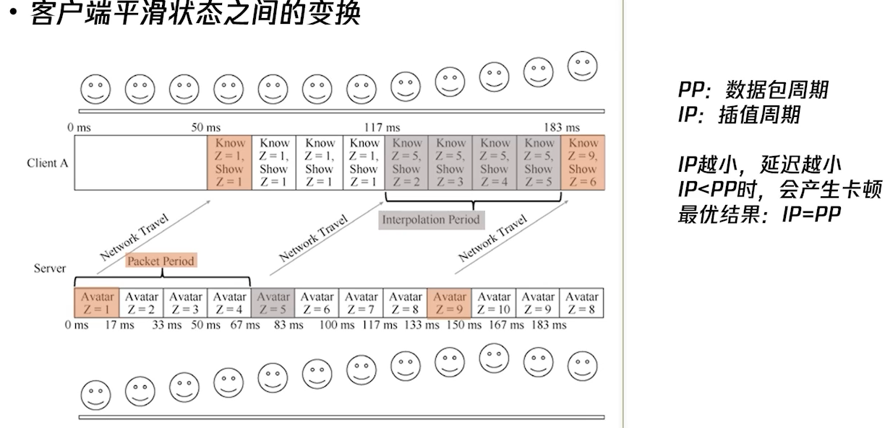
很显然插值优化会带来固定的延迟，在有些情况下我们需要对客户端进行一个预测。

- **客户端预测**
    1. 预测函数
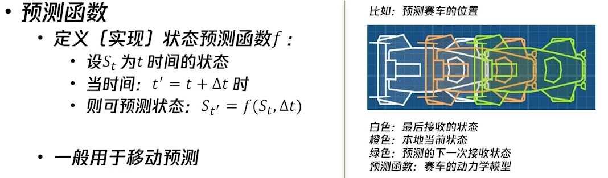

    2. 航位推测
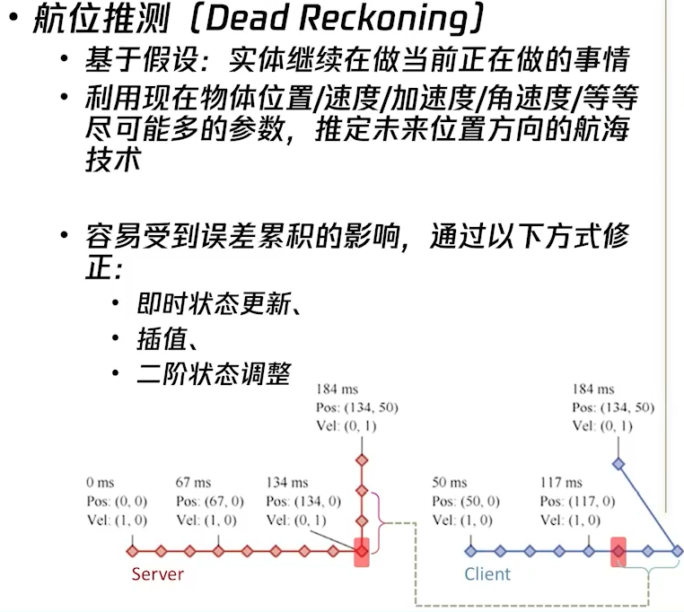

- **视觉掩饰**
    1. 前摇：演示本地输入到生效期间的网络延迟，提供各接收方等待缓冲时间
    2. 后摇：提供确定性，提高预测精度
    > 例如捡到随机道具会播放随机摇取然后得到最终确定性道具的动画，来掩饰服务器仲裁道具是什么的延迟时间。

- **同步范围与相关性**
权威服务器上拥有几乎所有的游戏状态，如果不加裁剪的同步客户端状态会很影响性能。这类优化有很多方法。
    1. 静态区域：将世界划分为一些静态区域，值同步其中一块（基于空间的均匀划分、基于POI(Point Of Interest)的不均匀划分等）
    2. 视锥、距离与可见性：只同步玩家视锥内的对象，或者距离玩家较近的对象的更多状态，而其他的对象状态同步的状态较少

- **同步频率与优先级**
    - 同步频率与相关性、优先级正相关
    - 事件同步的优先级高于状态同步
    - 通过休眠状态主动控制频率

- **断线重连**
直接从服务器恢复状态，由于服务器保持着游戏的关键状态甚至全部状态
> 曾经同步过的游戏事件怎么恢复？   这对客户端的逻辑有一定的要求，因为客户端的一些子状态或者一些局部状态是通过事件触发的，状态同步会同步状态也同步事件，那些通过事件同步来驱动的子级状态需要进行特殊处理，需要兼顾状态触发（因为事件是具有时效性的，有些事件发生之后是不会再同步到客户端的）

- **安全与反作弊**
安全问题：协议破解、敏感数据滥用
解决办法：
    - 延迟敏感的状态——本地维护状态，服务器后校验
    - 延迟不敏感的状态——服务器维护状态
    - 服务器限制不必要的数据同步，尽可能减少一些数据的下发（减少敏感数据）
    - 设置天花板阈值
    - 用户行为分析，识别作弊

#### 5. **实际案例**
参考示例：UE4Replication（基于方法【3】实现的）

**系统框架**
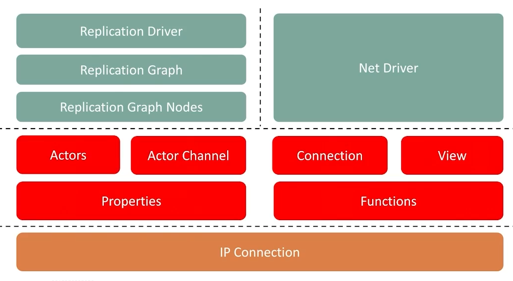

**基本流程**
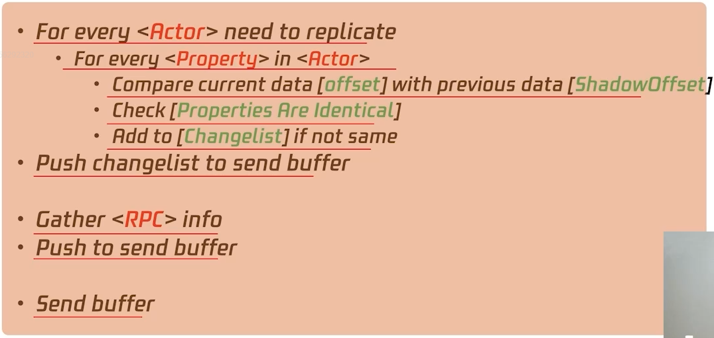
首先遍历每一个需要同步的Actor，然后遍历Actor每一个属性，对比这些属性是否已经同步过了，然后会同步一些发生变化的状态（将发生变化的状态放到一个Buffer里面去进行同步）
然后收集所有的RPC信息放到buffer里面，最后发送buffer。
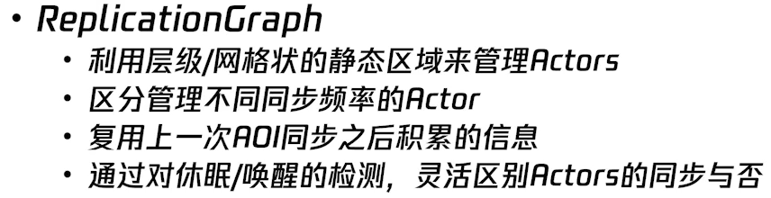

#### 6. 总结
- 优点：
    - 客户端计算量小（可以做一些单局规模非常大的游戏）
    - 网络敏感度低（FPS类游戏）
    - 技术门槛低（有现成的模块可以使用）
- 缺点：
    - 流量消耗大
    - 达到复杂逻辑一致性的难度很高（复杂逻辑状态很多，想要达到一致性有难度）
    - 后期维护成本高
    - 难以通用化（UE_Replication改善了这一点）

- 适用场景：射击、赛车、RPG、休闲

### 通用优化技术

#### 1. 协议优化：选TCP or UDP？
- TCP：可靠传输，但是弱网络环境下延迟较高（重传机制）
    多次超时重传会导致RTO值呈指数级增加
- UDP：不可靠传输，但是延迟低，适合实时性要求高
    我们需要对UDP进行一些封装来实现其可靠性
    -> **RUDP（Reliable UDP）**
        - 最简单的基于ARQ（Automatic Repeat reQuest）的封装RUDP-ARQ自动重传请求（ARQ的本质就是对于TCP的相关算法的简化，进一步来说就是对RTO的算法进行简化->非指数级增长）
            - 重传策略：等待式重传、后退n步重传、选择重传
            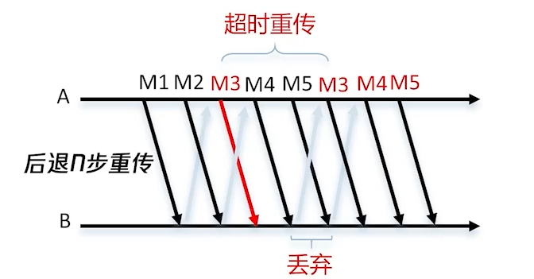
            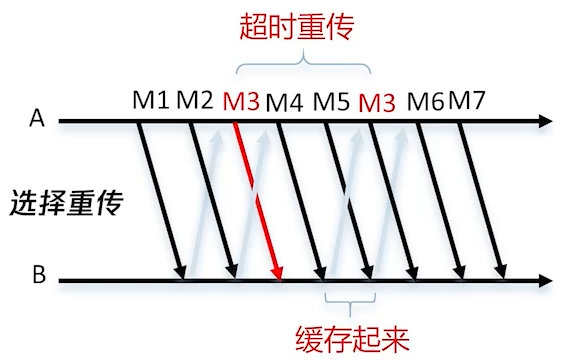

        - RUDP-FEC（Forward Error Correction，前向冗余纠错）
            - 代表方案VolP、UE_Replication
            - 丢包最小延时=0.5*RTT + FT = 70ms~100ms（一般FT=33ms或66ms，RTT~=80ms）
            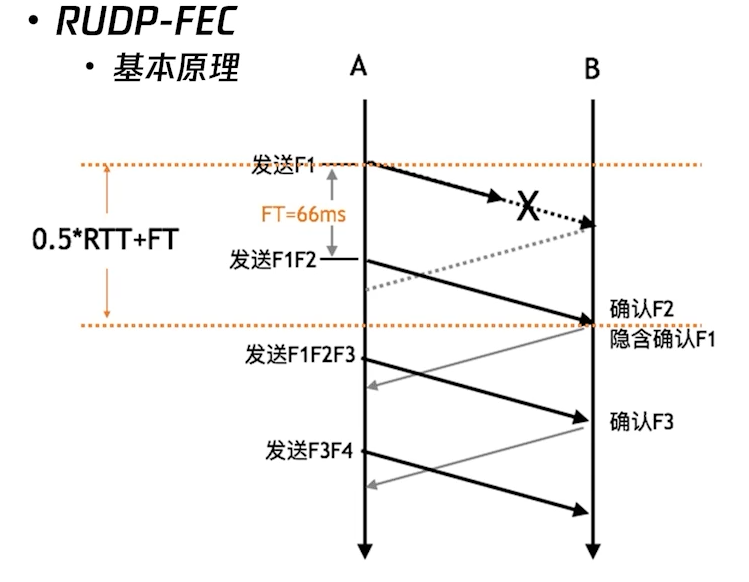

    - ARQ 与 FEC 对比
        - ARQ算法简单应用场合广泛，有通用的实现方式
        - FEC最小丢包延迟较低（<=1.5*RTT）

    - **ARQ-FEC 混合方案**（进一步优化）
        - 去掉非常复杂的FEC确认逻辑，实现算法非常简单
        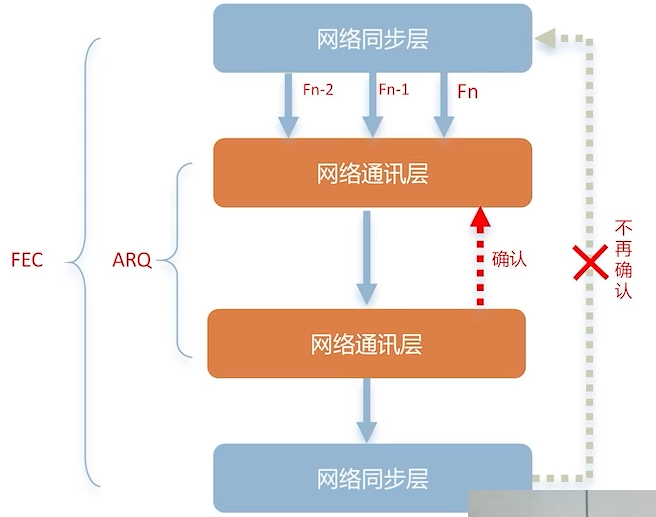

#### 2. UDP分组优化
当UDP包大小超过链路层的MTU时会发生IP分片-重组（一个分片丢掉了会认为整个大包丢掉了），增加丢包概率。
将一个UDP打包分成几个UDP小包进行发送，减少IP分片的情况，降低丢包概率。

#### 3. 随机丢包优化
丢包规律：
    - 相关性丢包：由底层原因造成，很难优化
    - 随机性丢包：
        - 原因：二进制信道噪音
        - 特点：无规律，随机出现（89%的丢包都是这种）
        优化方案：使用Gilbert-Model进行优化

### 帧同步 与 状态同步 对比
1. 确定性
    - 帧同步：具有强一致性
    - 状态同步：非本地仲裁数据有延迟或需要修正
2. 安全性
3. 实时性
4. 稳定性
    - 帧同步：断线重连逻辑非常复杂，需要服务器缓存所有帧数据，发回给重连的客户端，从断线帧开始追帧到当前帧
    - 状态同步：服务器保存当前状态，重连客户端同步使用服务器状态
5. 开销-流量
    - 帧同步：总体同步流量少，空帧优化
    - 状态同步：总体同步流量大，AOI优化
6. 开销-研发成本
    - 帧同步：技术门槛高，同步模块研发成本高，项目整体研发成本低
    - 状态同步：技术门槛低，同步模块研发成本低，项目整体研发成本高

### 相关知识
1. 协议栈设计

一般情况下，表现层的数据格式都会采用现成的序列化格式（例如Json、Xml、Protobuf），也可以采用自定义序列化格式

2. 协议加密
一般都采用对称加密（例如DES、AES、TEA/XTEA/XXTEA），注重加解密的性能

3. RPC
应用层协议接口的一种实现
基本原理：把协议的发送与接收封装成为像函数调用一样方便
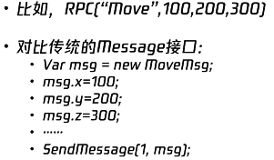